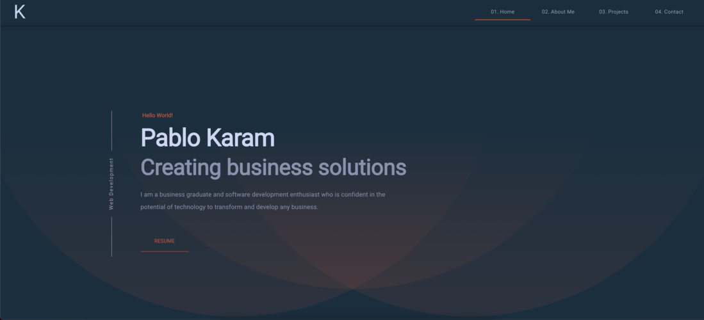

<h1 align="center">
  Pablo Karam
</h1>
<p align="center">
  The first version of <a href="https://pablokaram.netlify.app" target="_blank">pablokaram.netlify.app</a> built with <a href="https://www.gatsbyjs.org/" target="_blank">Gatsby</a> and hosted with <a href="https://www.netlify.com/" target="_blank">Netlify</a>
</p>

<p align="center">
  <a href="https://app.netlify.com/sites/brittanychiang/deploys" target="_blank">
    
  </a>
</p>



## Description

This is my personal portfolio project made with Gatsby, Dato CMS and Material UI, a minimalistic and modern static web page with great performance.


## 🛠 Installation & Set Up

1. Install the Gatsby CLI

   ```sh
   npm install -g gatsby-cli
   ```

2. Install and use the correct version of Node using [NVM](https://github.com/nvm-sh/nvm)

   ```sh
   nvm install
   ```

3. Install dependencies

   ```sh
   npm install
   ```

4. Start the development server

   ```sh
   gatsby develop
   ```

## 🚀 Building and Running for Production

1. Generate a full static production build

   ```sh
   gatsby build
   ```

1. Preview the site as it will appear once deployed

   ```sh
   gatsby serve
   ```

<!-- AUTO-GENERATED-CONTENT:END -->
